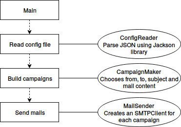

# A RES-SMTP-Client
## A small forged mail prank software

This software was developed in the scope of a Network course at HEIG-VD, Switzerland. It comes with no warranties of
any kind, and actually, it's not really legal to send forged mails like that, it's basically called spam.

This software works with a configuration file like that:
```json
{
    "victims": ["abc@def.xyz", "marcus@zucc.facebook", "john.tr@avol.ta"],
    "contents": [
        {
            "subject": "A small prank",
            "content": "Was fun wasn't it?"
        }
    ],
    "groups": 2,
    "ehlo": "lilPrank",
    "mockServer": {
        "server": "localhost",
        "port"2525
    }
}
```

- victims, define a list of email addresses, at least 3
- contents, define some mail contents
- groups, amount of campaigns to run
- ehlo is the content of the `ehlo` command sent to the SMTP server
- mockServer, wether to use a mock server, one ships with the software

Basically, the software will count the amount of campaigns you want (groups value),
and for each one pick one `from` and a random amount of `to` (from 2 to n)
from the list of victims you defined. It will then choose a random mail content
from the config file, and attempt to send the mail.

### Running the software
1. Create a configuration file, one ships with this for example, called `config.json`
2. If you want to use a mockServer and use docker, run the following commands from inside
  the `mock` directory:
    - `docker build -t prank/smtp .` to build the docker image
    - `docker run -p 8282:8282 -p 2525:2525 prank/smtp` to start a container. You can then access the web interface from `localhost:8282` and the SMTP port `2525` in your config file
3. Run the project, providing it with the config file path you just created

### MockServer

This project ships with [MockMock](https://github.com/tweakers-dev/MockMock) a great smtp mock server built in java. You can either start it running `java -jar MockMock.jar -p 2525 -h 8282` from within the `mock` directory, to start it listening on port `2525` for SMTP request (define it in your config file) and `8282` to access the web interface

### Implementation

This software implements a small piece of the SMTP protocol. It ships with a small SMTPClient which is responsible to handle SMTP interactions with the server, and a small helper to find out SMTP server lurking over DNS entries.



1. First, the main is loaded, which asks for a configuration file.
2. A `ConfigReader` is created to parse the file, it is based on the Jacson parsing library
3. A `CampaignMaker` is created, which creates `config:groups` campaigns. It simply picks one email address from the victim as the `from`, a random amount of victims to be `to` and a random email content with subject to send.
4. A `MailSender` is created, responsible to send a mail for each campaign created previously.
5. For each campaign, the `MailSender` creates a `SMTPClient` which is responsible to handle the connexion. If a mock server is configured, it simply uses it, otherwise it finds out the SMTP server for the `from` email address using DNS entries.
6. Mails are sent one after the other.